# 🎉 TA-DA WORLD - 실시간 GPS 기반 보물찾기 게임


## 💙 배경 및 개요

학교, 회사, 각종 단체에서의 야유회를 가 본 경험이 있나요? 서로 단합하고 친목을 도모하기 위해 TA-DA WORLD 보물찾기 게임을 해보세요!

지도에 GPS를 기반으로 보물을 숨기고 게임을 시작합니다. 참가자는 지도에 실시간으로 위치가 반영되고 보물에 가까워지면 알림을 받을 수 있습니다.

### 프로젝트 진행 기간

2023.04.10(월) ~ 2023.05.19(금)

---

## 💙 핵심 기능

[핵심 컨셉] 보물을 찾으면 보상이 TA-DA(짜-잔)!

### 🎉 호스트

- 카카오 로그인을 통해 게임방을 관리합니다.

#### 게임방 만들기

- 게임 이름과 플레이 시간을 설정합니다.
- 보물 사진, 위치(위도/경도), 힌트를 지정하여 보물을 숨깁니다.
- 지도를 통해 보물의 위치를 미세조정할 수 있습니다.
- 보물을 찾으면 얻을 수 있는 보상 사진과 설명을 등록할 수 있습니다.

#### 게임방 관리

- 게임방에 참여한 참가자 리스트를 볼 수 있습니다.
- 보물 지도를 통해 게임방에 등록된 보물들의 위치를 확인합니다.
- 방의 상태(방 정보 수정, 대기방, 게임중, 게임 종료)를 변경할 수 있습니다.
- 참가자들에게 전체 공지를 보낼 수 있습니다.

#### 게임 종료

- 보물 찾기 결과를 지도로 확인합니다.
- 참가자들의 보물 사냥 순위를 확인할 수 있습니다.

### 🎉 참가자

- **로그인 없이** 게임방에 참여할 수 있도록 **접근성**을 높였습니다.

#### 게임방 입장

- 참여코드를 입력하여 게임방에 입장합니다.
- 게임방 내 중복되지 않는 별명을 설정하고 캐릭터를 선택합니다.
- 참가자들의 목록을 볼 수 있습니다.
- 호스트가 게임을 시작하면 카운트 다운이 시작되고 소켓을 이용한 실시간 소통 플레이가 시작됩니다.

#### 보물찾기

- 지도에 실시간 GPS 위치 기반으로 나의 캐릭터가 표시됩니다.
- 오른쪽 하단 버튼을 통해 보물들의 힌트를 확인할 수 있습니다.
- 보물에 근접하면 지도에 보물 아이콘이 표시됩니다.
- 지도에서 보물 아이콘을 클릭하여 보물 사진 정답 제출을 할 수 있습니다.
- AI 모델을 활용한 이미지 유사도 측정 결과 정답이면 보물의 보상을 획득하게 됩니다.

#### 게임 종료

- 내가 찾은 보물의 목록과 보상을 확인할 수 있습니다.
- 보물 지도에서 보물의 위치와 보물 사진, 찾은 사람을 볼 수 있습니다.
- 보물 사냥 순위를 통해 나의 순위를 확인할 수 있습니다.

---

## 💻 주요 기술

### Backend - Spring

- IntelliJ IDE
- JVM 11
- Springboot 2.7.12
- Gradle 7.6.1
- Spring Data JPA
- Swagger 3.0
- Lombok
- MySQL, Workbench
- AWS RDS
- AWS S3
- OAuth 2.0

### Backend - Python

- Python 3.8.6
- fastapi 0.95.1
- OpenCV 4.7.0.72
- PyTorch 2.0.0
- AI: SuperPoint + SuperGlue
- SuperPoint: 이미지 특징점 추출 모델
- [SuperGlue](https://github.com/magicleap/SuperGluePretrainedNetwork): 특징점 매칭 모델

### Frontend

- VSCode
- Figma
- React
- TypeScript
- Tailwind CSS
- Node LTS 18.16.0
- Yarn

### CI/CD

- AWS EC2 - CI Server
  - Ubuntu 20.04 LTS
  - Jenkins
  - Docker
- AWS EC2 - CD Server
  - Ubuntu 20.04 LTS
  - Nginx
  - SSL (certbot)
  - Docker

#### System Architecture


## 💻 프로젝트 파일 구조

```
  Java
    ├── gradle
    │   └── wrapper
    └── src
        └── main
            ├── java
            │   └── com
            │       └── voda
            │           ├── config
            │           ├── controller
            │           ├── domain
            │           │    └── dto
            │           │    └── entity
            │           ├── exception
            │           ├── repository
            │           ├── service
            │           └── util
            └── resources
                └── application.yml

    Python
    ├── img
    │   ├── answer
    │   ├── treasure
    └── models
        └── weights
    ├── main.py
    └── requirements.txt

    React
    ├── .env
    └── src
        ├── assets
        │   ├── css
        │   └── fonts
        │   └── images
        ├── components
        │   └── common
        │   └── hosthome
        │   └── hostroom
        │   └── userendgame
        │   └── usergame
        │   └── userpregame
        ├── hooks
        ├── layout
        ├── pages
        │   └── ouath
        ├── stores
        └── utils
```

---

## 💙 협업 환경

- GitLab

  - 코드 버전 관리
  - Git-flow 도입
  - Merge Request를 통한 코드 리뷰

- JIRA

  - 매주 월요일 백로그 작성 후 스프린트 생성
  - 업무의 할당량을 정해 Story Point 설정
  - In-Progress -> Done 순으로 작업

- Notion

  - 오전 스크럼 미팅 회의록 작성 및 문서화

- MatterMost

  - Team, Bot channel을 통해 소통

- Postman

  - 개발한 API를 테스트할 수 있는 도구
  - Workspace 생성 후 Collection 공유하여 생산성 높임

## 💙 팀원 역할

- 한원석 (BE)

  - Spring Boot API 설계 및 구현
  - JWT 인증 로직 구현
  - Websocket 서버 구현

- 김민경 (FE)

  - 프론트엔드 페이지 및 컴포넌트 디자인 개선
  - SockJs를 활용한 게임 진행 연동
  - 참가자 닉네임 유효성 검사 구현
  - 게임 진행 타이머 구현
  - 게임 참가자 상태관리

- 김재희 (Infra & BE)

  - CI, CD 서버 분리 구축
  - Jenkins Pipeline 작성 및 Gitlab CI/CD 연결
  - CI Server: GitLab Webhook -> Jenkins Pipeline: Build, Dokcer Push
  - CD Server: Nginx, SSH Server -> Docker Pull, container run
  - Spring RestTemplate을 활용한 FastAPI model 통신 구현

- 박진우 (FE)

  - 프론트엔드 기술환경 구성 (tsconfig.json, tailwind.config.js, eslintrc.js)
  - 프론트엔드 코드리뷰 및 관리 담당
  - 소셜 로그인 구현
  - 네트워크 처리 및 토큰 리프레쉬 로직 모듈화
  - 게임 진행 및 지도 구현 (Geolocation API, kakao map)
  - 게임 참가자 상태관리

- 이유경 (FE)

  - React project 환경 설정
  - 주최자 페이지 로직 설계 및 구현

- 정다은 (BE/AI)

  - Spring Boot API 설계 및 구현
  - Fast API 설계 및 구현
  - AI 모델 활용해 이미지 유사도 판단 (SuperPoint:특징점 검출 + SuperGlue:특징점 매칭)
  - Rest API 문서화 및 관리

- 공통
  - 기능명세서, API 명세서 작성
  - DB 설계
  - 목업 디자인
  - 자료 조사, 아이디어

## 🎉 프로젝트 산출물

- [컨벤션](https://zacinthepark.notion.site/Convention-7248794340e943e399bccf31cf2e173c)
- [목업디자인]()
- [기능명세서](https://zacinthepark.notion.site/24e7859d69ce49f4a920b286dd90b0d6)
- [API명세서](https://zacinthepark.notion.site/API-ea19e92c4ae8437ca1e209c3ff325ae6)
- [발표자료]()
- [UCC](https://www.youtube.com/watch?v=XefxKX9d4Ok)
- [포팅매뉴얼](https://lab.ssafy.com/s08-final/S08P31A503/-/blob/main/exec/README.md)
- [환경변수설정-Java](https://lab.ssafy.com/s08-final/S08P31A503/-/blob/main/exec/README.md)
- [환경변수설정-React](https://lab.ssafy.com/s08-final/S08P31A503/-/blob/main/exec/README.md)

---

## 💙 시연 영상

### 🎉 호스트

- 로그인 및 방 만들기

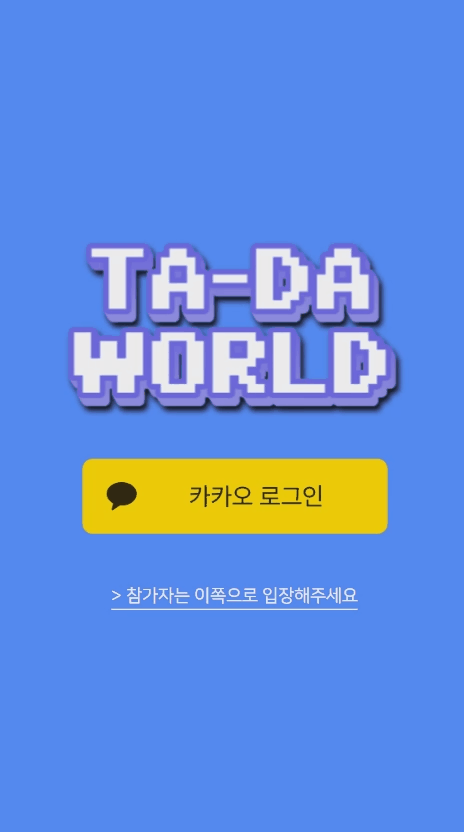

- 보물 등록

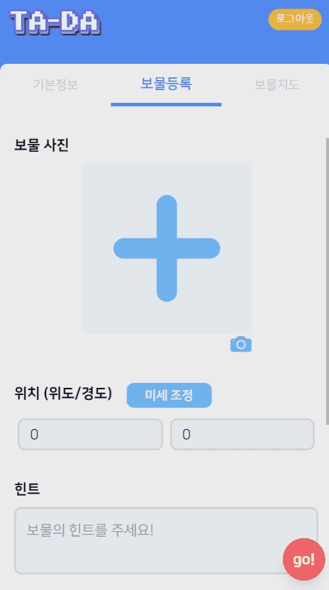

- 보물 지도

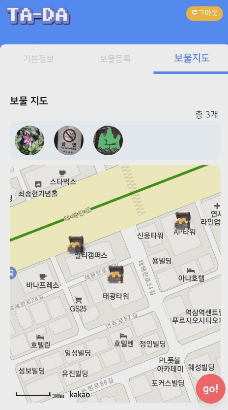

- 대기방 만들기: 보물 등록을 완료하고 참가자가 들어올 수 있는 상태로 만듭니다.

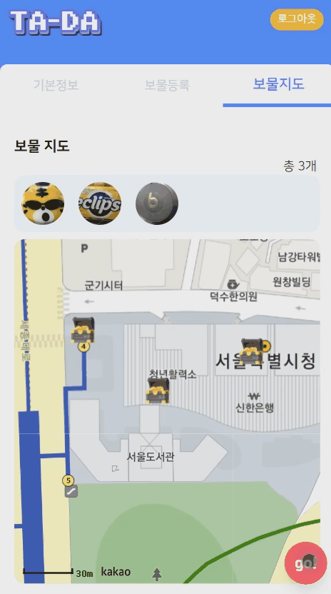

- 초대코드 공유하기

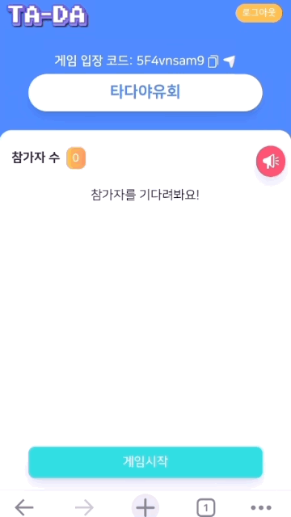

- 카카오톡으로 초대하기

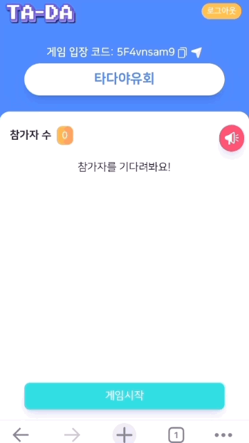

### 🎉 참가자

- 게임방 입장 (닉네임, 캐릭터 설정)


### 🎉 게임방

- 참가자 리스트


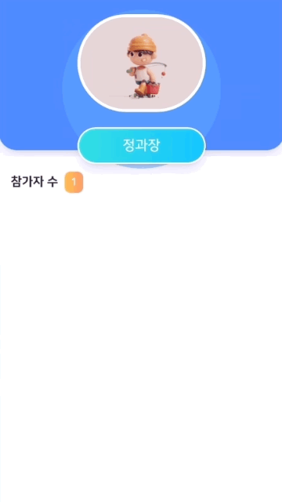

- 공지 알림

왼쪽: 호스트, 오른쪽: 참가자

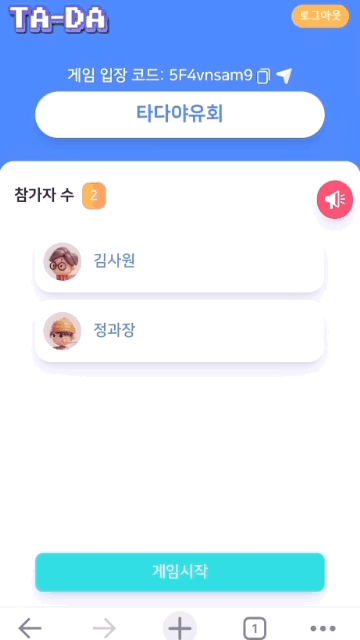
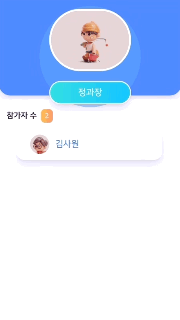

- 게임 시작

왼쪽: 호스트, 오른쪽: 참가자


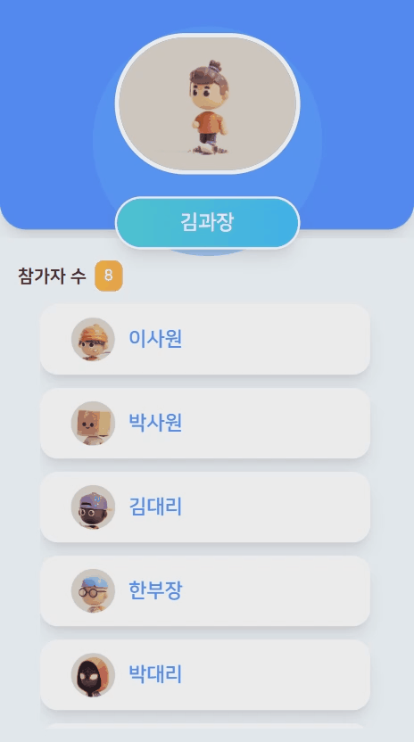

- 실시간 위치 이동


- 보물 정답 사진 제출

왼쪽: 호스트, 오른쪽: 참가자

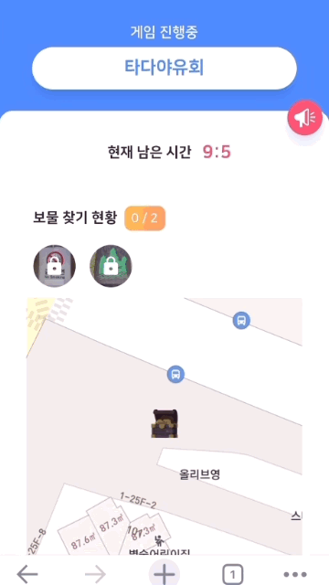


- 힌트 보기

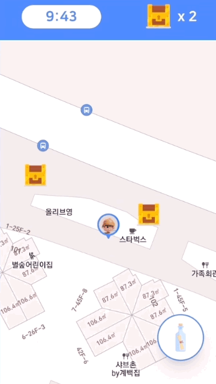

- 게임 종료

왼쪽: 호스트, 오른쪽: 참가자

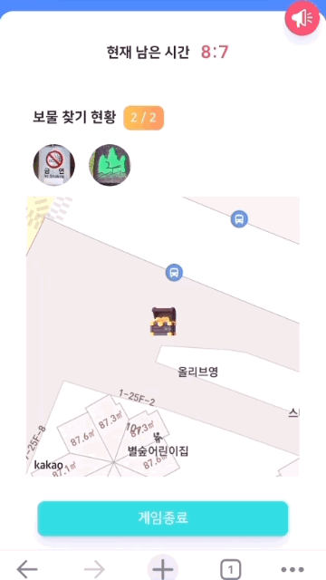
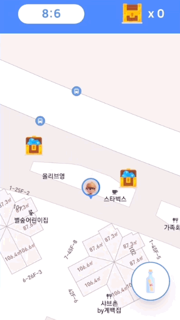
